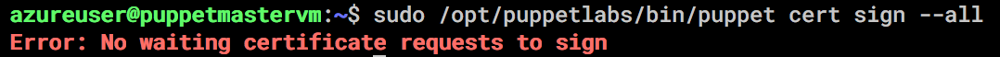

# Puppet Test

Investigating configuring an Ubuntu Linux server using Puppet. 

- .tf files for Puppet Master server: `puppet_master.tf`, `puppet_master_variables.tf`.
- .tf files for Puppet Agent node server: [here](https://github.com/nick-otter/terraform-azure-virtual-machine[]).

## Notes on Process

As I haven't used Puppet before, I have highlighted parts of the process to use Puppet that are interesting or differ from Ansible.

- I am currently facing an issue with sigining certs - which I have configured via the `/etc/hosts` file.  
On the Puppet Master server, despite adding the master IP to the agent's `/etc/hosts` file. No certificate requests are evident:
    
On the Puppet Agent server, `ping` to the Puppet Master is not successful (hanging) - this could be the issue:

 

## Links 

- [How To Install Puppet 4 On Ubuntu 16 04](https://www.digitalocean.com/community/tutorials/how-to-install-puppet-4-on-ubuntu-16-04)
- [Why is the /etc/hosts file not working?](https://askubuntu.com/questions/347152/why-is-the-etc-hosts-file-not-working)